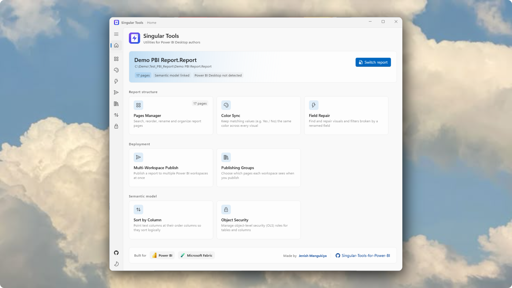
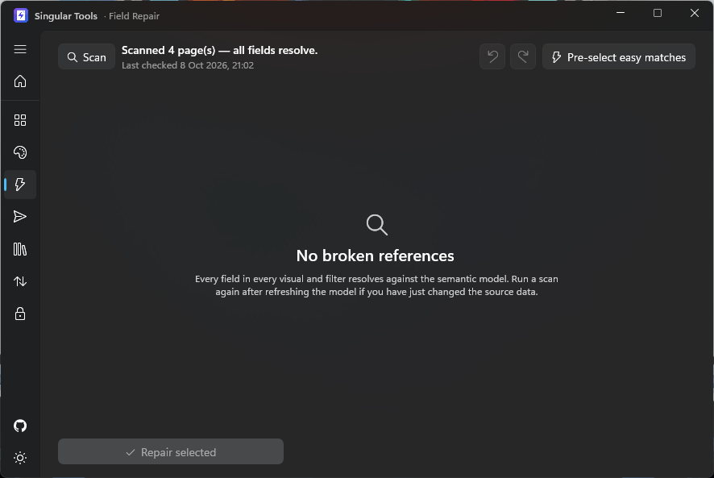

# ⚡ Singular Tools for Power BI

**A modern Windows toolbox for Power BI Desktop authors who are tired of the gaps.** Singular Tools plugs into Power BI Desktop's **External Tools** ribbon and automates the repetitive, click-heavy work that Power BI still doesn't do for you — page management, consistent colors, repairing fields broken by a rename, multi-workspace publishing, object-level security (OLS), sort-by-column setup, and more. Built with WinUI 3 and .NET 10.

Power BI has matured rapidly, but many features the community has asked for were never shipped. Singular Tools was built by a data nerd, for fellow data nerds, to fill those gaps.

<p align="center">
  
  <br><br>
  
  <br>
  <sub>Singular Tools ships with full <b>light and dark themes</b> — switch anytime from the toggle in the left rail.</sub>
</p>

[](LICENSE)


[](https://github.com/jenishmangukiya/Singular-Tools-for-Power-BI/releases)
[](#-is-it-safe-no-viruses)

<p align="center">
  &nbsp;&nbsp;&nbsp;
  &nbsp;&nbsp;&nbsp;
  
</p>
<p align="center"><sub>Designed for the Microsoft Power BI and Microsoft Fabric ecosystem</sub></p>

> ⚠️ **Disclaimer:** Singular Tools is an independent community project. It is not affiliated with, endorsed by, or sponsored by Microsoft. Power BI is a trademark of Microsoft Corporation.

---

## ✨ Feature Highlights

The app opens on a **Home launcher** that groups every tool under **Report structure**, **Deployment**, and **Semantic model**, and tells you up front whether each tool is ready (e.g. *Needs a report*, *Needs a semantic model*) — so you never open an empty page. It ships with full **light and dark themes**, switchable from the left rail.

### 🗂️ Pages Manager — page management at scale

If your report has more than a handful of pages, Power BI's tab bar quickly becomes painful: navigation is tedious, creating, duplicating, and reordering pages means constant right-clicking, and the built-in UI isn't fluid. Pages Manager gives you a single, keyboard-friendly list where you can:

- **Search** pages instantly to jump to the one you need
- **Rename** pages inline (`F2`), toggle page visibility, **duplicate** a page (`Ctrl + D`), and **delete** pages with `Delete`
- **Reorder** pages by dragging (or with **Move up/down/top/bottom**), with **Sort A→Z / Z→A / Natural sort / Reverse**, and full **undo/redo** (`Ctrl + Z` / `Ctrl + Y`)
- **Multi-select** with `Ctrl`/`Shift`-click to act on several pages at once — move, sort, hide, duplicate or delete a whole group together, so you can relocate a block of pages in a single drag instead of one at a time
- Jump the open report straight to any page with **Go to page**

*Use case:* a 20-page operations report where stakeholders want "Page 12" renamed, duplicated as a template, and moved to the front — done in seconds instead of a dozen clicks per page.

<p align="center">
  
</p>

### 🎨 Color Sync — one consistent color per value, everywhere

When you're working with categorical data — especially Likert-scale responses (*Strongly Agree…Strongly Disagree*), segments, or yes/no flags — Power BI makes you re-assign colors for bars and columns **every time** you add or duplicate a visual. Color Sync fixes that:

- Define each value's color **once** (e.g. `Strongly Agree` → green, `Strongly Disagree` → red)
- Pick colors with a built-in **color picker** (or sample one straight off the screen)
- Apply to the **entire report** or only to specific pages
- Every matching visual picks up the same color instantly

*Use case:* you have a customer-satisfaction survey with five response options across eight visuals on three pages. Instead of clicking through 40 color pickers, you set five colors and hit **Apply to report**.

<p align="center">
  
</p>

### 🩹 Field Repair — fix everything a column rename broke, in one pass

When a source system renames a column, Power BI leaves the report binding a field the model no longer resolves. The visual still renders, but the series is empty, a sort order silently stops working, or conditional-formatting rules go inert. Field Repair finds **every** broken reference and repoints it:

- Scans visuals, **visual-level filters**, **page filters**, and the **report filter** in one pass
- Shows each **missing field** alongside **where it is used** (which page/visual/filter, and how many times)
- Lets you choose the replacement from any column **or measure** still in the model
- Repairs the binding *and* the cached `queryRef` / `nativeQueryRef` / `metadata` using whole-token substitution, so a neighbouring field like `SegmentCode` is never corrupted
- **Undo/redo** for every repair, and an optional **Pre-select easy matches** for case/spacing/punctuation-only renames
- Re-scans automatically when the report or the semantic model changes, so the list is never stale

*Use case:* the finance team renames `Month Name` → `Monthh`. Instead of hunting through dozens of visuals and four kinds of filter, Field Repair lists the missing field once and repoints every usage.

<p align="center">
  
</p>

### 📤 Multi-Workspace Publish — publish once, to many

If you belong to a large organization, the *same* report often needs to land in several workspaces. Today that means hitting **Publish** again and again, re-selecting each workspace, and waiting for every run. Multi-Workspace Publish automates it:

- Tick the target workspaces from a single checklist
- The tool drives Power BI Desktop's publish dialog for you — no manual clicking, no forgotten destinations
- Detected workspaces are cached per machine, and your ticked destinations travel with the report in `singular-tools.json`

*Use case:* a monthly finance pack that must reach `Finance`, `FP&A`, `Board`, and `Regional Managers` — four ticks instead of four full publish cycles.

<p align="center">
  
</p>

### 📑 Publishing Groups — one report, multiple audiences

A single sales report may need to reach the **Board workspace** (every page visible) and the **Operations workspace** (critical pages hidden). Today that usually means maintaining two copies of the same `.pbip` — with this tool it's one report:

- Save a named **group** of pages per audience (*Board – Full*, *Operations – Limited*)
- Publish a group to any workspace; page visibility is applied just for the publish and **restored afterwards**, so your editing copy never changes
- Groups travel with the report in `singular-tools.json`

*Use case:* one sales report, four audiences, zero duplicate `.pbip` files to keep in sync.

<p align="center">
  
</p>

### 🔃 Sort by Column — stop wiring up sort orders by hand

Your data engineers typically push a `Country_ord` or `Country_num` column for every categorical field you might need to sort logically. But wiring each one up in Power BI means opening every column, finding the matching order column, and repeating it — fine for 3 columns, **agonizing for 50 or more**. Sort by Column automates the whole pass:

- Detects text columns and matches each one to its order column using a configurable **order-column suffix** (for example `Country` → `Country_ord`)
- Applies the **Sort by column** setting directly in the model's TMDL files
- Supports undo and pushes the change into the open Power BI Desktop window through the external-changes flow

*Use case:* a sales model with 60 categorical columns — the tool configures all sort orders in one click instead of an afternoon of clicks.

<p align="center">
  
</p>

### 🔐 Object Security — the OLS manager Power BI never gave you

Power BI ships a friendly UI for **RLS** (row-level security), but no equivalent UI for **OLS** (object-level security) — hiding whole tables or sensitive columns from specific roles still means hand-writing TMDL. Object Security fills that gap:

- Pick a role and hide an entire table or individual columns with toggles
- Stage changes, review them, then apply to the model's role TMDL
- Validation flags relationship-chain breaks and redundant rules, and it understands the TMDL shorthand Power BI itself writes
- Roles can carry **RLS filters and OLS rules together**, and each role in the list is badged with what it contains

*Use case:* your *Auditor* role shouldn't see the `Salaries` table at all, and *Recruiters* shouldn't see `Compensation`. Object Security configures it all in one pass — and those rules can live in the same role as your existing RLS filters.

<p align="center">
  
</p>

---

## 🚀 Getting Started

### Option A — Install the ready-made app (recommended)

1. Open the **[Releases page](https://github.com/jenishmangukiya/Singular-Tools-for-Power-BI/releases)** (the latest build is published as a rolling release, tag `latest`).
2. Download the installer for your machine:
   - **`SingularTools-<version>-x64-Setup.exe`** — most PCs (Intel/AMD 64-bit)
   - **`SingularTools-<version>-x86-Setup.exe`** — 32-bit Windows
   - **`SingularTools-<version>-arm64-Setup.exe`** — Windows on ARM
3. Run it. It installs **per-user** (no admin) to `%LOCALAPPDATA%\SingularTools\`, optionally creates a desktop shortcut, and offers a **"Register with Power BI Desktop"** task.
4. **Restart Power BI Desktop**, open a report (`.pbip`/`.pbix`), and click **External Tools → Singular Tools**.

> The app is currently **unsigned**, so Windows SmartScreen may warn the first time. That is a reputation warning, not a virus detection — see [Is it safe?](#-is-it-safe-no-viruses) below. The installer is **self-contained**: no .NET runtime needed.

### Option B — Build & run from source

Prerequisites:
- Windows 10 (1809+) or Windows 11
- [.NET 10 SDK](https://dotnet.microsoft.com/download)
- Power BI Desktop (optional, for live sync and publishing)

```powershell
dotnet run --project src/SingularTools.App/SingularTools.App.csproj
```

On first launch, click **Open report** and pick a `.pbip` project. To explore without touching real work, use the demo project checked in at `Assets/Test_PBI_Report/Demo PBI Report.pbip`.

### Register in Power BI Desktop's External Tools ribbon (manual)

If you built from source, or chose not to register during install:

```powershell
pwsh -ExecutionPolicy Bypass -File distribution/register-external-tool.ps1
```

This publishes a Release build to `%LOCALAPPDATA%\SingularTools\` and writes the external-tool manifest into Power BI's `External Tools` folder (prompting for admin, since that folder is under `Program Files (x86)`). **Restart Power BI Desktop** and find **Singular Tools** under the **External Tools** tab.

To only copy an already-generated manifest as admin (no publish):

```powershell
distribution\register-as-admin.cmd
```

### Build the installers (x64 / x86 / ARM64)

Requires [Inno Setup 6](https://jrsoftware.org/isinfo.php) (`winget install JRSoftware.InnoSetup`):

```powershell
pwsh -ExecutionPolicy Bypass -File distribution/installer/build-installers.ps1 -Version 1.0.0
```

Output lands in `distribution/installer/output/` as `SingularTools-<version>-<arch>-Setup.exe`. The installers are per-user, register with Power BI, and ship with an uninstaller.

### Run the tests

```powershell
dotnet test
```

---

## ⌨️ Keyboard Shortcuts

| Shortcut | Action | Scope |
| :--- | :--- | :--- |
| `↑` / `↓` | Navigate page list | Pages Manager |
| `Enter` | Set active page | Pages Manager |
| `F2` | Rename selected page | Pages Manager |
| `Ctrl + Z` / `Ctrl + Y` | Undo / redo | Pages Manager, Color Sync, Field Repair |
| `Ctrl + D` | Duplicate selected page | Pages Manager |
| `Delete` | Delete selected page | Pages Manager |
| `Esc` | Clear search | Pages Manager |

---

## 🧭 How It Works

- **PBIR / PBIP native** — reads and writes `definition/pages/pages.json` and `page.json` directly, with atomic writes and automatic reload in Power BI Desktop.
- **Two-way live sync** — saves Desktop's unsaved changes before editing, and applies external changes after we write, serialized so Desktop and the tools never fight over the files. On first activation a short handshake waits for the pages/model watchers to settle.
- **Snapshot-based undo history** per session; model edits (Sort by Column, Object Security) are snapshotted per project in the model backup store, scoped per tool.
- **Repairs are safe by construction** — Field Repair rewrites field bindings and cached display strings by whole-token substitution, and also repairs report-level filters that live outside the pages folder, so Undo reverts everything together.
- **Every tool plugs in** via `IToolPage` + `ToolRegistry` — adding a tool is one folder and one descriptor.

---

## 🛠️ Project Structure

```
├── distribution/            # External-tool manifest, registration & Inno Setup installers
├── docs/screenshots/        # Images used in this README
├── src/
│   ├── SingularTools.Core/  # PBIP/PBIR model, edit history, TMDL services, broken-field repair, window detection
│   └── SingularTools.App/   # WinUI 3 shell + one folder per tool under Tools/
└── tests/SingularTools.Tests/
```

---

## 🛡️ Is it safe? (No viruses)

**Short version: yes.** Singular Tools is open source, makes no network connections, and every released installer is built by GitHub Actions straight from the source in this repository.

**Concrete proof you can check yourself:**

1. **No telemetry, no phoning home.** The app makes **no outbound network calls** — no analytics, no auto-updater, no account sign-in. The only external link in the code is the GitHub repository URL, which is opened in your browser only when you click it. You can verify this in the source (`src/` contains no `HttpClient`/`WebClient`/socket/telemetry code).
2. **Built in public CI from this source.** `.github/workflows/release.yml` runs the test suite and compiles the installers on a GitHub-hosted runner for every push to `main`, then attaches the three `*-Setup.exe` files to the [Releases](https://github.com/jenishmangukiya/Singular-Tools-for-Power-BI/releases) page.
3. **Reproducible from source.** Anyone can build the exact app locally with:
   ```powershell
   dotnet publish src/SingularTools.App/SingularTools.App.csproj -c Release -o "$env:LOCALAPPDATA\SingularTools"
   ```
4. **Verify the download.** Confirm the file hash matches the release before running it:
   ```powershell
   Get-FileHash .\SingularTools-<version>-x64-Setup.exe -Algorithm SHA256
   ```
5. **Scan it on VirusTotal (optional).** Upload the `.exe` to <https://www.virustotal.com/gui/home/upload> and check the result for the version you downloaded.

> **Why SmartScreen warns:** the binaries are **not code-signed** yet (unsigned builds trigger SmartScreen's reputation warning). This is expected and is *not* a malware detection. Verify the SHA-256 hash above before running if you want certainty.

**SHA-256 of the current release installers** (verify with `Get-FileHash`):

| Release asset | SHA-256 |
| :--- | :--- |
| `SingularTools-1.0.1-x64-Setup.exe` | `30fd70afcc1c29e26263cb78337c81d345ce89274e343e5bfd3f2a39b33b4671` |
| `SingularTools-1.0.1-x86-Setup.exe` | `7dada1db42166c389d6271d2ef8c610cfc3e078b03ab6731add42a53615e2a85` |
| `SingularTools-1.0.1-arm64-Setup.exe` | `66a94051daa3eb8a871ed9be76ed538422cae53c08acc258a744bfb2fe4be1fa` |

<sub>Hashes are for the current rolling build and change with each release — update this table (or point readers to the auto-generated digest on the Releases page) whenever a new build ships.</sub>

---

## 🤝 Contributing

Issues, feature requests, and pull requests are welcome. Please run `dotnet test` before submitting and keep changes consistent with the existing patterns (see `AGENTS.md` for an architecture walkthrough).

## 📄 License

Licensed under the [Apache License 2.0](LICENSE). See [NOTICE](NOTICE) for third-party attributions and trademark notice.

---

## 🔑 Keywords

`Power BI external tool` · `Power BI Desktop utility` · `PBIP PBIR` · `Power BI report pages manager` · `Power BI page navigation` · `Power BI broken visual repair` · `Power BI rename column fix` · `Power BI sort by column` · `Power BI object level security OLS` · `Power BI RLS OLS manager` · `Power BI publish to multiple workspaces` · `Power BI publishing groups` · `Power BI consistent colors across visuals` · `Power BI semantic model TMDL editor` · `Power BI developer tools` · `WinUI 3 Power BI` · `.NET 10 desktop app` · `Power BI productivity` · `Power BI automation`
