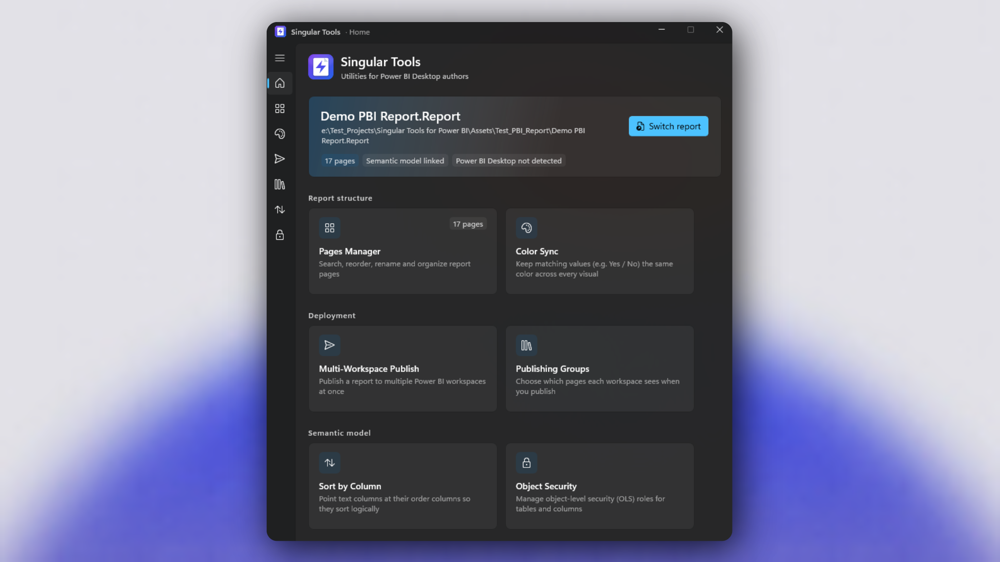
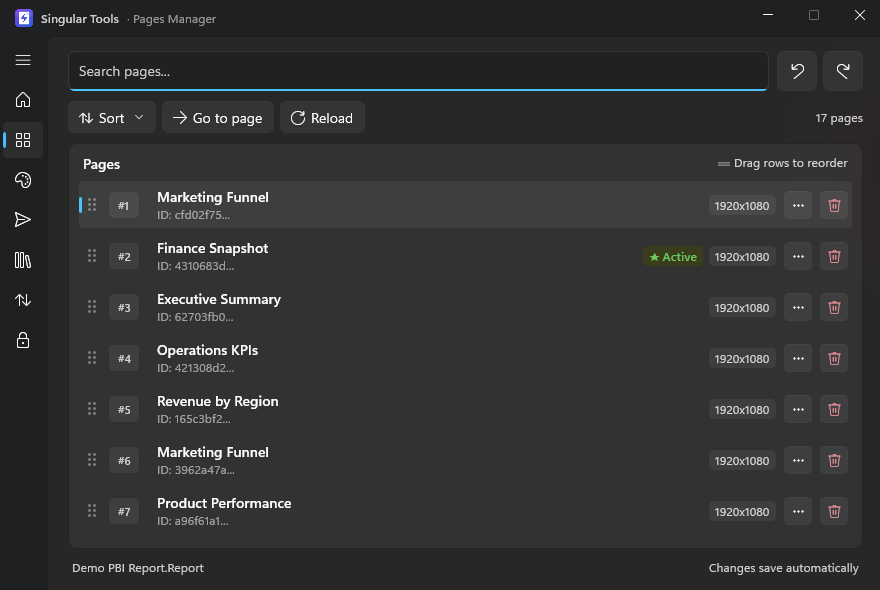
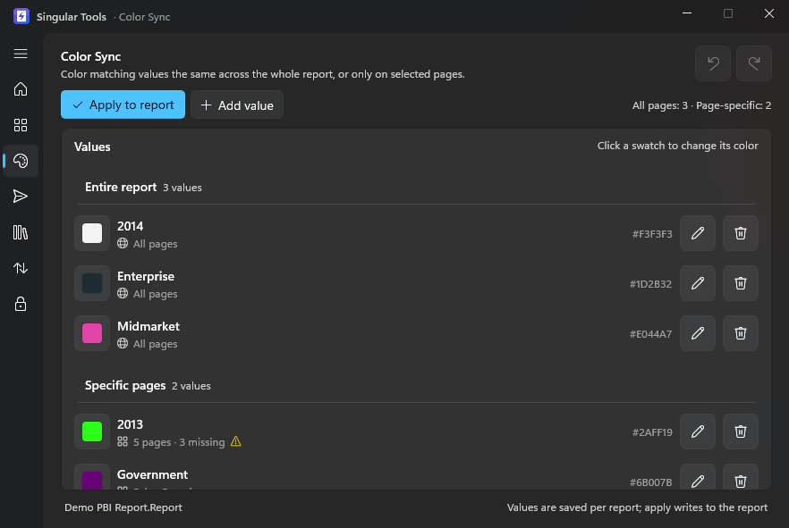
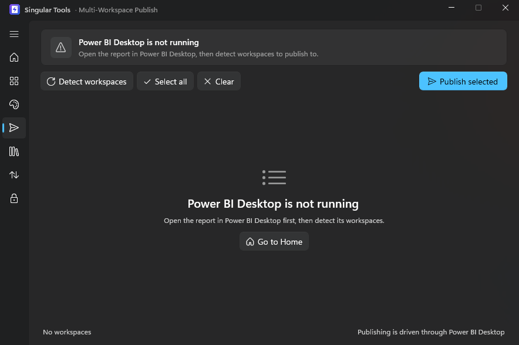
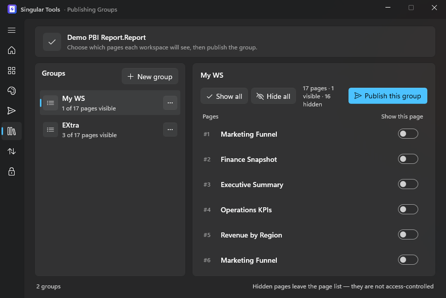
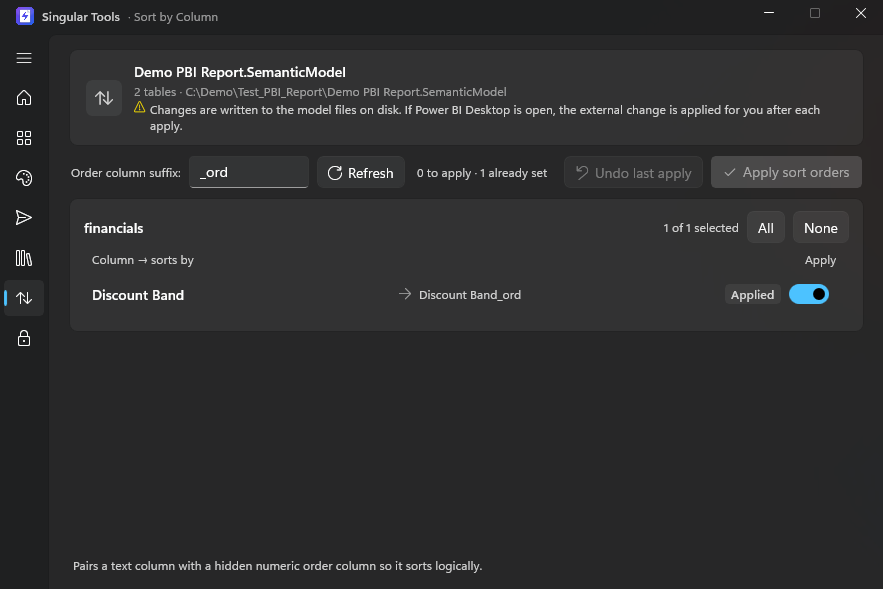
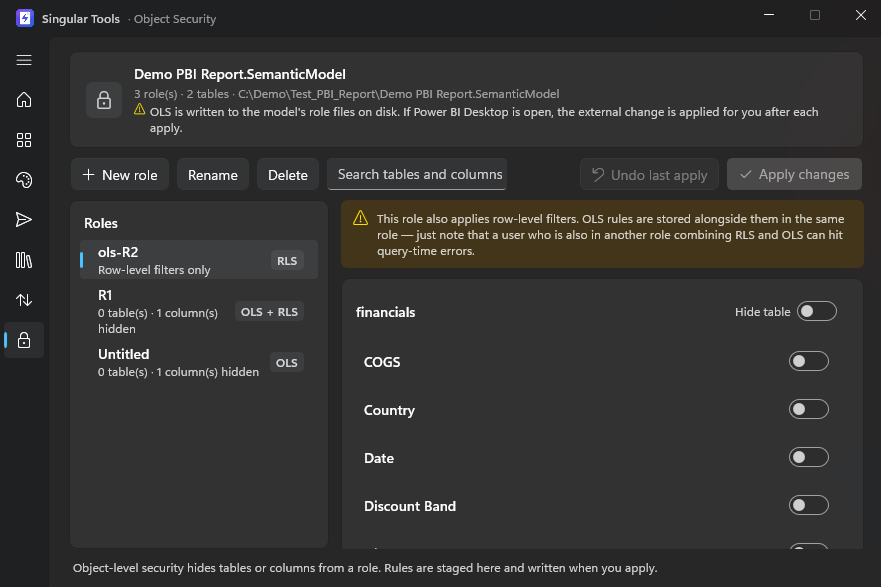

# ⚡ Singular Tools for Power BI

**A modern Windows toolbox for Power BI Desktop authors who are tired of the gaps.** Singular Tools plugs into Power BI Desktop's **External Tools** ribbon and automates the repetitive, click-heavy work that Power BI still doesn't do for you — page management, consistent colors, multi-workspace publishing, OLS, sort-by-column setup, and more. Built with WinUI 3 and .NET 10.

Power BI has matured very rapidly, but many features the community has asked for never shipped. Singular Tools was built by a data nerd, for fellow data nerds, to fill those gaps.

<p align="center">
  
</p>

[](LICENSE)


<p align="center">
  &nbsp;&nbsp;&nbsp;
  &nbsp;&nbsp;&nbsp;
  
</p>
<p align="center"><sub>Designed for the Microsoft Power BI & Microsoft Fabric ecosystem</sub></p>

> ⚠️ **Disclaimer:** Singular Tools is an independent community project. It is not affiliated with, endorsed by, or sponsored by Microsoft. Power BI is a trademark of Microsoft Corporation.

---

## ✨ Feature Highlights

### 🗂️ Pages Manager — page management at scale

If your report has more than a handful of pages, Power BI's tab bar quickly becomes painful: navigation is tedious, creating, duplicating, and reordering pages means constant right-clicking, and the built-in UI isn't fluid. Pages Manager gives you a single, keyboard-friendly list where you can:

- **Search** pages instantly to jump to the one you need
- **Rename** pages inline (`F2`), toggle hidden/visible, **duplicate** (`Ctrl + D`), and **delete** with `Delete`
- **Reorder** pages by dragging, with full **undo/redo** (`Ctrl + Z` / `Ctrl + Y`)
- Jump the open report straight to any page with **Go to page**

*Use case:* a 20-page operations report where the stakeholders want "Page 12" renamed, duplicated as a template, and moved to the front — done in seconds instead of a dozen clicks per page.

<p align="center">
  
</p>

### 🎨 Color Sync — one consistent color per value, everywhere

When you work with categorical data — especially Likert-scale responses (*Strongly Agree…Strongly Disagree*), segments, or yes/no flags — Power BI makes you re-assign colors for bars/columns **every time** you add or duplicate a visual. Color Sync fixes that:

- Define each value's color **once** (e.g. `Strongly Agree` → green, `Strongly Disagree` → red)
- Apply to the **entire report** or only to specific pages
- Every matching visual picks up the same color instantly

*Use case:* you have a customer-satisfaction survey with five response options across eight visuals on three pages. Instead of clicking through 40 color pickers, you set five colors and hit **Apply to report**.

<p align="center">
  
</p>

### 📤 Multi-Workspace Publish — publish once, to many

If you belong to a large organization, the *same* report often needs to land in several workspaces. Today that means hitting **Publish** again and again, re-selecting each workspace, and waiting for every run. Multi-Workspace Publish automates it:

- Tick the target workspaces from a single checklist
- The tool drives the publish for you — no manual clicking, no forgotten destinations
- Detected workspaces are cached per machine, and your ticked destinations travel with the report in `singular-tools.json`

*Use case:* a monthly finance pack that must reach `Finance`, `FP&A`, `Board`, and `Regional Managers` — four clicks instead of four full publish cycles.

<p align="center">
  
</p>

### 📑 Publishing Groups — one report, multiple audiences

A single sales report may need to reach the **Board workspace** (every page visible) and the **Operations workspace** (critical pages hidden). Today that usually means maintaining two copies of the same `.pbip` — with this tool it's one report:

- Save a named **group** of pages per audience (*Board – Full*, *Operations – Limited*)
- Publish a group to any workspace; page visibility is applied just for the publish and **restored afterwards**, so your editing copy never changes
- Groups travel with the report in `singular-tools.json`

*Use case:* one sales report, four audiences, zero duplicate `.pbip` files to keep in sync.

<p align="center">
  
</p>

### 🔃 Sort by Column — stop wiring up sort orders by hand

Your data engineers typically push a `Country_ord` or `Country_num` column for every categorical field you might need to sort logically. But wiring each one up in Power BI means opening every column, finding the matching order column, and repeating it — fine for 3 columns, **agonizing for 50+**. Sort by Column automates the whole pass:

- Detects text columns and matches them to their `_ord` / ordering counterparts
- Applies the **Sort by column** setting directly in the model's TMDL files
- Undo support, and it pushes the change into open Power BI Desktop via the external-changes flow

*Use case:* a sales model with 60 categorical columns — the tool configures all sort orders in one click instead of an afternoon of clicks.

<p align="center">
  
</p>

### 🔐 Object Security — the OLS manager Power BI never gave you

Power BI ships a friendly UI for **RLS** (row-level security), but no equivalent UI for **OLS** (object-level security) — hiding whole tables or sensitive columns from specific roles still means hand-writing TMDL. Object Security fills that gap:

- Pick a role and hide an entire table or individual columns with toggles
- Stage changes, review them, then apply to the model's role TMDL
- Validation flags relationship-chain breaks and redundant rules, and it understands the TMDL shorthand Power BI itself writes

*Use case:* your *Auditor* role shouldn't see the `Salaries` table at all, and *Recruiters* shouldn't see `Compensation`. OLS configures it in one pass — and it can live in the same role as your existing RLS filters.

<p align="center">
  
</p>

---

## 🚀 Getting Started

### Prerequisites
- Windows 10 (1809+) or Windows 11
- [.NET 10 SDK](https://dotnet.microsoft.com/download)
- Power BI Desktop (optional, for live sync and publishing)

### Build & Run
```powershell
dotnet run --project src/SingularTools.App/SingularTools.App.csproj
```
On first launch Singular Tools offers to open a report folder (the `.Report` project). You can also point it at the demo project in `Assets/Test_PBI_Report` to explore without touching real work.

### Run the tests
```powershell
dotnet test
```

### Register in Power BI Desktop's External Tools ribbon
```powershell
pwsh -ExecutionPolicy Bypass -File distribution/register-external-tool.ps1
```
This publishes a Release build to `%LOCALAPPDATA%\SingularTools\` and registers the external-tool manifest. Restart Power BI Desktop and find **Singular Tools** under the **External Tools** ribbon tab.

### Build installers (x64 / x86 / ARM64)
Requires [Inno Setup 6](https://jrsoftware.org/isinfo.php):
```powershell
pwsh -ExecutionPolicy Bypass -File distribution/installer/build-installers.ps1 -Version 1.0.0
```
Output in `distribution/installer/output/`. Installers are per-user, register with Power BI, and ship an uninstaller.

---

## ⌨️ Keyboard Shortcuts

| Shortcut | Action | Scope |
| :--- | :--- | :--- |
| `↑` / `↓` | Navigate page list | Pages Manager |
| `Enter` | Set active page | Pages Manager |
| `F2` | Rename selected page | Pages Manager |
| `Ctrl + Z` / `Ctrl + Y` | Undo / redo | Pages Manager |
| `Ctrl + D` | Duplicate selected page | Pages Manager |
| `Delete` | Delete selected page | Pages Manager |
| `Esc` | Clear search | Pages Manager |

---

## 🧭 How It Works

- **PBIR / PBIP native** — reads and writes `definition/pages/pages.json` and `page.json` directly, with atomic writes and automatic reload in Power BI Desktop.
- **Two-way live sync** — saves Desktop's unsaved changes before editing, and applies external changes after we write, serialized so Desktop and the tools never fight over the files.
- **Snapshot-based undo history** per tool; model edits are snapshotted per project in the model backup store.
- **Every tool plugs in** via `IToolPage` + `ToolRegistry` — adding a tool is one folder and one descriptor.

---

## 🛠️ Project Structure

```
├── distribution/            # External-tool manifest, registration & Inno Setup installers
├── docs/screenshots/        # Images used in this README
├── src/
│   ├── SingularTools.Core/  # PBIP/PBIR model, edit history, TMDL services, window detection
│   └── SingularTools.App/   # WinUI 3 shell + one folder per tool under Tools/
└── tests/SingularTools.Tests/
```

---

## 🤝 Contributing

Issues, feature requests, and pull requests are welcome. Please run `dotnet test` before submitting and keep changes consistent with the existing patterns (see `AGENTS.md` for an architecture walkthrough).

## 📄 License

Licensed under the [Apache License 2.0](LICENSE). See [NOTICE](NOTICE) for third-party attributions and trademark notice.

---

## 🔑 Keywords

`Power BI external tool` · `Power BI Desktop utility` · `PBIP PBIR` · `Power BI report pages manager` · `Power BI page navigation` · `Power BI sort by column` · `Power BI object level security OLS` · `Power BI RLS OLS manager` · `Power BI publish to multiple workspaces` · `Power BI publishing groups` · `Power BI consistent colors across visuals` · `Power BI semantic model TMDL editor` · `Power BI developer tools` · `WinUI 3 Power BI` · `.NET 10 desktop app` · `Power BI productivity` · `Power BI automation`
